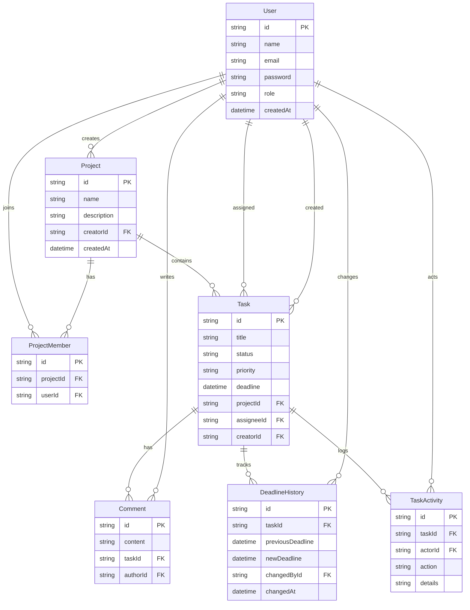

# Nimora

Team project and task management app for the Full Stack Developer assignment.

Nimora lets an **admin** run projects and assign work, while **team members** update status, leave progress notes, and see deadlines. When a task deadline changes, the previous and new dates are stored and shown as a timeline.

## Tech stack

| Layer | Choice |
| --- | --- |
| Frontend | React 19, Vite, React Router, Tailwind CSS |
| Backend | Node.js, Express, Zod |
| Database | SQLite via Prisma |
| Auth | JWT + bcrypt, role-based access (`ADMIN`, `MEMBER`) |

## Features

### Admin

- Create projects and add team members
- Create tasks, assign people, set priority and deadline
- Edit tasks (including deadline changes)
- View project progress
- Create user accounts

### Team member

- Register / sign in
- View projects they belong to and tasks assigned to them
- Update status on their own tasks
- Add comments and progress updates
- See deadlines, priorities, and deadline history

### Extra

- Deadline history (required challenge)
- Task activity log
- Search and filters by status / priority
- Form validation on client and server
- Seeded demo data
- Docker Compose setup
- Automated tests for deadline-history rules

## Demo accounts

After seeding:

| Role | Email | Password |
| --- | --- | --- |
| Admin | `admin@nimora.app` | `Admin@123` |
| Member | `alex@nimora.app` | `Member@123` |
| Member | `jordan@nimora.app` | `Member@123` |

## Installation

Requires **Node.js 20+**.

```bash
npm install
npm run setup
npm run dev
```

This starts:

- API: http://localhost:4000
- Web app: http://localhost:5173

Keep both terminals open. The API process should stay running and **not** print `Completed running`. If port 5173 is busy, Vite may jump to 5174; use the URL it prints.

### Manual setup

```bash
cd backend
copy .env.example .env   # Windows
# cp .env.example .env   # macOS / Linux
npm install
npm run db:setup
npm run dev
```

```bash
cd frontend
npm install
npm run dev
```

### Docker

```bash
docker compose up --build
```

App: http://localhost:5173 · API: http://localhost:4000

## Tests

```bash
npm test
```

## Database schema



`Task.status`: `TODO` | `IN_PROGRESS` | `DONE`  
`Task.priority`: `LOW` | `MEDIUM` | `HIGH` | `URGENT`  
`User.role`: `ADMIN` | `MEMBER`

## Deadline history

Updating a task deadline writes a `DeadlineHistory` row with:

- previous deadline
- new deadline
- who changed it
- when it changed

The task page shows this as a timeline. Unchanged deadlines are not recorded.

## API overview

Base URL: `http://localhost:4000/api`  
Authenticated routes send `Authorization: Bearer <token>`.

Full endpoint list: [docs/API.md](docs/API.md)

| Method | Path | Access | Purpose |
| --- | --- | --- | --- |
| POST | `/auth/register` | Public | Create member account |
| POST | `/auth/login` | Public | Sign in |
| GET | `/auth/me` | Auth | Current user |
| GET | `/dashboard` | Auth | Overview stats |
| GET/POST | `/users` | Admin | List / create users |
| GET | `/projects` | Auth | List accessible projects |
| POST | `/projects` | Admin | Create project |
| GET/PATCH/DELETE | `/projects/:id` | Auth / Admin | Project detail |
| POST | `/projects/:id/members` | Admin | Add member |
| DELETE | `/projects/:id/members/:userId` | Admin | Remove member |
| POST | `/projects/:id/tasks` | Admin | Create task |
| GET | `/tasks` | Auth | List / filter tasks |
| GET/PATCH | `/tasks/:id` | Auth | Task detail / update |
| GET/POST | `/tasks/:id/comments` | Auth | Comments |
| GET | `/tasks/:id/deadline-history` | Auth | Deadline timeline |
| GET | `/tasks/:id/activity` | Auth | Activity log |

Members may only change **status** on tasks assigned to them. Admins may edit all task fields.

## Project structure

```text
backend/     Express API, Prisma schema, seed data
frontend/     React SPA
docs/         API documentation
```

## Live deployment (Render + Netlify)

The GitHub repo is [Frosty3316/nimora](https://github.com/Frosty3316/nimora).

### 1. API on Render

1. Open [Render Dashboard](https://dashboard.render.com) and sign in with GitHub.
2. **New > Blueprint**, select `Frosty3316/nimora`, and apply `render.yaml`.
3. After the first deploy, copy the service URL.
4. Confirm `https://nimora-phh7.onrender.com/api/health` returns `{ "ok": true }`.

The free instance sleeps after idle time, so the first request can take about a minute.

### 2. Frontend on Netlify

1. Open [Netlify](https://app.netlify.com) and **Add new site > Import an existing project**.
2. Choose GitHub and `Frosty3316/nimora`.
3. Netlify reads `netlify.toml` (base `frontend`, publish `dist`).
4. If the Render URL changes, update the `/api/*` redirect in `netlify.toml` and redeploy.

Demo logins are the same as local: `admin@nimora.app` / `Admin@123`.

## Submission notes

- GitHub: https://github.com/Frosty3316/nimora
- Live site: Netlify URL after deploy
- API: https://nimora-phh7.onrender.com
